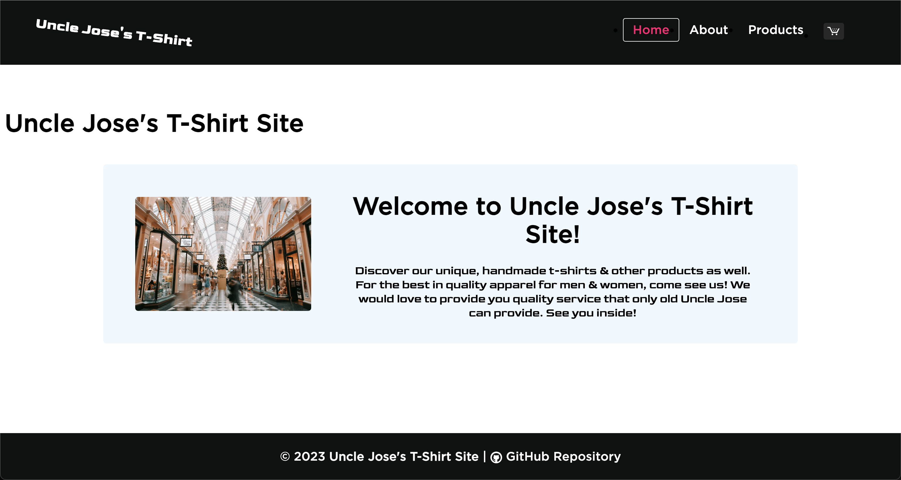
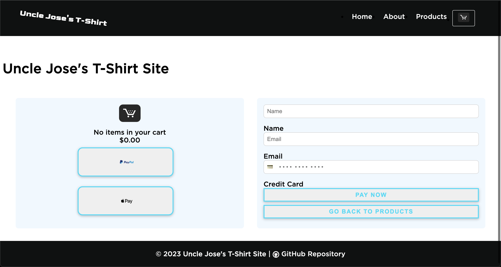
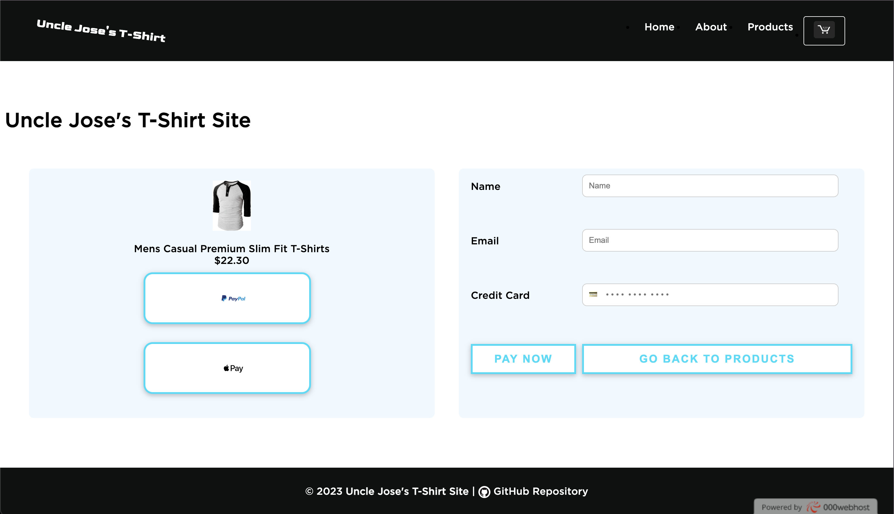
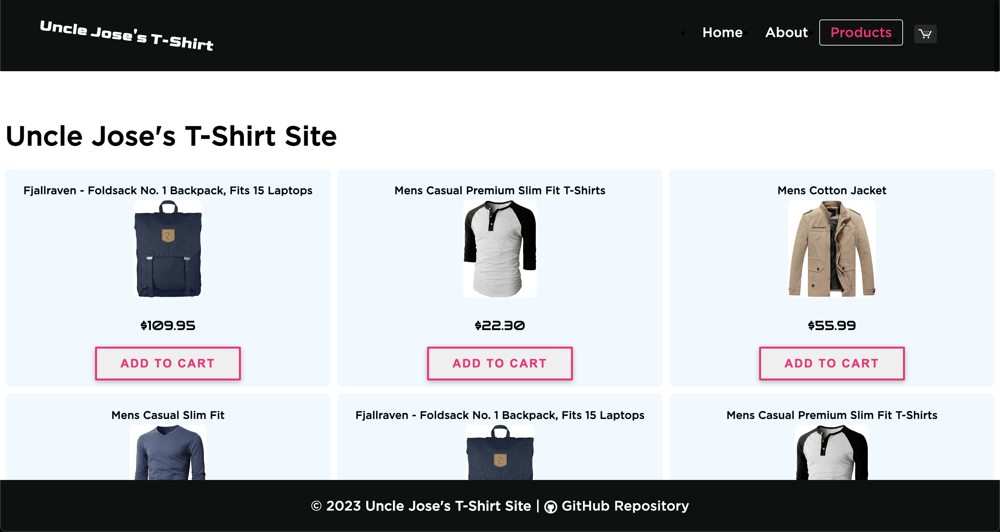
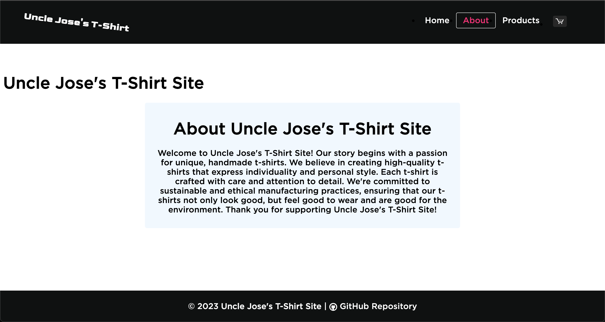
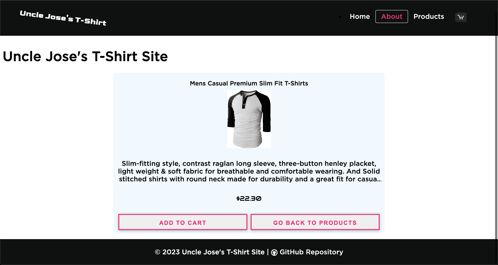

# Uncle Jose's T-Shirt Shop

This project, developed by Jose Martinez, is an e-commerce Single Page
Application (SPA) built from scratch using Vanilla Typescript, HTML, and
CSS. It showcases a list of t-shirts, an about page, a products page, and
simulates a shopping cart experience. The SPA is built without the use of
frameworks like React or Vue, which provides an opportunity to grasp the
underlying web development concepts that these frameworks abstract away.



## Key Features

- **Vanilla TypeScript**: The project uses TypeScript, a statically typed
  superset of JavaScript, to bring type-safety and improved developer
  tooling to the project. Working with Vanilla TypeScript, as opposed to a
  framework like React or Vue, provides a more fundamental understanding of
  JavaScript, the Document Object Model (DOM), and state management.

- **Custom Routing**: Unlike using a routing library as in most React or
  Vue applications, this project implements custom routing using the
  browser's `hashchange` event. This functionality allows for navigation
  between different views without a full page reload, providing an SPA like
  user experience.

##### Code Example - Custom Routing

```ts
// FILE: hooks/router/use-router.ts
// _______________________________________________

import { AboutPage, CartPage, HomePage, ProductsPage } from "../pages";

type RouteChangeType = {
	useRouteChange: () => Promise<void>
}

export function useRouter(rootElement: HTMLElement): RouteChangeType {
	const useRouteChange = async (): Promise<void> => {
		rootElement.innerHTML = '';
		
		let [routeName, productId] = location.hash.split('/');
		// remove the '#' from routeName
		routeName = routeName.replace('#', '');
		
		switch (routeName) {
			case 'home':
				rootElement.appendChild(HomePage());
				break;
			case 'about':
				rootElement.appendChild(await AboutPage(productId));
				break;
			case 'products':
				rootElement.appendChild(await ProductsPage());
				break;
			case 'cart':
				rootElement.appendChild(await CartPage(productId));
				break;
			default:
				location.hash = 'home';
				routeName = 'home';
		}
		
		// Dispatch a custom event with the new route name
		window.dispatchEvent(new CustomEvent('routechange', { detail: routeName }));
	};
	
	return {
		useRouteChange,
	};
}

```

- **Reusable Components**: The project uses a component-based architecture,
  a concept central to most modern web development frameworks. Components
  such as header, footer, and navbar are reused across different pages to
  maintain consistency. Each component is implemented as a function that
  returns a DOM element, which can then be appended where necessary.

##### Code Example - Reusable Component

 

```ts
// FILE: components/cart/cart.ts
// _______________________________________________

import { ProductType } from "../../types/types";
import { useCartData } from '../../hooks/use-cart-data';
import './cart.css';

export function CartComponent(product?: ProductType): DocumentFragment {
	const {
		productData: defaultProductData,
		bindGoBackButton,
		paypalIcon,
		applePayIcon,
	} = useCartData();
	
	const productData = product || defaultProductData;
	
	const divElement = document.createElement('div');
	divElement.innerHTML = (`
    <div class="cart-container">
      <div class="cart-side cart-item">
        
        <div class="cart-title">${ productData.title }</div>
        <div class="cart-price">$${ productData.price.toFixed(2) }</div>
        <div class="pay-option">
          <button class="btn btn-icon">
            
          </button>
        </div>
        <div class="pay-option">
          <button class="btn btn-icon">
            
          </button>
        </div>
      </div>
      <div class="cart-side pay-form">
        <input class="cart-input" type="text" id="name" name="name" placeholder="Name" required />
        <label class="cart-input-label" for="name">Name</label>
        <input class="cart-input" type="email" id="email" name="email" placeholder="Email" required />
        <label class="cart-input-label" for="email">Email</label>
        <input class="cart-input" type="text" id="card" name="card" placeholder="💳    • • • •  • • • •  • • • •" required />
        <label class="cart-input-label" for="card">Credit Card</label>
        <button class="btn pay-now" type="submit">
          Pay Now
        </button>
        <button class="btn go-back">
          Go Back to Products
        </button>
      </div>
    </div>
  `);
	
	bindGoBackButton(divElement);
	
	const groupedDomNodesFragment = document.createDocumentFragment();
	while (divElement.firstChild) {
		groupedDomNodesFragment.appendChild(divElement.firstChild);
	}
	
	return groupedDomNodesFragment;
}
```



```ts
// FILE: components/products/products.ts
// _______________________________________________

// FILE: components/products/products.ts
// _______________________________________________

import { useProductEvents } from "../../hooks";
import { ProductType } from "../../types/types";
import { useFakeStoreApi } from "../../api/use-fake-store-api";
import './products.css';

export async function ProductsComponent(category: string, limit: number = 24): Promise<DocumentFragment> {
	const {
		onProductContentClick,
		onAddToCartButtonClick,
	} = useProductEvents();
	const { getProductsInCategory } = useFakeStoreApi();
	
	// fetching the data from the API based on the category and limit of items
	const productData = await getProductsInCategory(category, limit);
	// creating a DocumentFragment to group the DOM nodes
	const groupedDomNodesFragment = new DocumentFragment();
	
	const productListDivElement = document.createElement('div');
	productListDivElement.classList.add('product-list');
	
	productData.forEach((product: ProductType) => {
		const productDivElement = document.createElement('div');
		productDivElement.classList.add('product-item');
		
		productDivElement.innerHTML = (`
      <div class="product-content" data-id="${ product.id }">
        <h2 class="product-title">${ product.title }</h2>
        <div class="product-image">
          
        </div>
        <p class="product-price">$${ product.price.toFixed(2) }</p>
      </div>
      <button class="add-to-cart" data-id="${ product.id }">
        Add to Cart
      </button>
    `);
		
		// Using our custom hook to handle the product events
		onProductContentClick(productDivElement, Number(product.id));
		onAddToCartButtonClick(productDivElement, Number(product.id));
		
		productListDivElement.appendChild(productDivElement);
	});
	
	groupedDomNodesFragment.appendChild(productListDivElement);
	return groupedDomNodesFragment;
}
```

##### Code Example - Custom Hooks

```ts
// FILE: hooks/use-cart-data.ts
// _______________________________________________

import { ProductType } from "../types/types";

export type CartDataType = {
	productData: ProductType;
	bindGoBackButton: (divElement: HTMLDivElement) => void;
	paypalIcon: string;
	applePayIcon: string;
};

export function useCartData(): CartDataType {
	const paypalIcon = "/assets/images/paypal.png";
	const applePayIcon = "/assets/images/apple-pay.png";
	
	const defaultProduct: ProductType = {
		title: 'No items in your cart',
		price: 0.0,
		image: '/assets/images/white_amz_cart.png',
		category: '',
		description: '',
	};
	
	const bindGoBackButton = (divElement: HTMLDivElement) => {
		const goBackButton = divElement.querySelector('.go-back') as HTMLButtonElement;
		goBackButton.onclick = (event) => {
			event.stopPropagation();
			location.hash = `#products`;
		};
	};
	
	return {
		productData: defaultProduct,
		bindGoBackButton,
		paypalIcon,
		applePayIcon,
	};
}
```

- **API Integration**: This project integrates with the Fake Store API to
  fetch product data. This simulates the experience of fetching and
  displaying data from a real back-end service. Typically, a framework
  would provide hooks or other abstractions to handle this, but in this
  project it's handled manually with the fetch API.

##### Code Example - API Integration

```ts
// FILE: src/api/use-fake-store-api.ts
// _______________________________________________

import { ProductListType, ProductType } from "../types/types";

export function useFakeStoreApi() {
	const getAllProducts = async (): Promise<ProductListType> => {
		const response = await fetch('https://fakestoreapi.com/products');
		const products = await (response.json()) as ProductListType;
		return products;
	};
	
	const getSingleProduct = async (id: number): Promise<ProductType> => {
		const response = await fetch(`https://fakestoreapi.com/products/${ id }`);
		const product = await (response.json()) as ProductType;
		return product;
	};
	
	const getLimitedProducts = async (limit: number = 5): Promise<ProductListType> => {
		const response = await fetch(`https://fakestoreapi.com/products?limit=${ limit }`);
		const products = await (response.json()) as ProductListType;
		return products;
	};
	
	const getProductsInCategory = async (category: string, limit: number = 20): Promise<ProductListType> => {
		const response = await fetch(`https://fakestoreapi.com/products/category/${ category }?limit=${ limit }`);
		const products = await response.json() as ProductListType;
		
		// Check if the number of products is less than the desired limit
		if (products.length < limit) {
			// Duplicate the existing products to fill up the remaining slots
			const additionalProductsNeeded = limit - products.length;
			const duplicatedProducts = Array.from({ length: additionalProductsNeeded }, (_, index) => {
				const sourceProductIndex = index % products.length;
				const clonedProduct = { ...products[ sourceProductIndex ] }; // Clone the product using the spread operator
				return clonedProduct;
			});
			
			// Append the duplicated products to the product's array
			products.push(...duplicatedProducts);
		}
		
		return products;
	};
	
	
	const getSortedProducts = async (order: 'asc' | 'desc'): Promise<ProductListType> => {
		const response = await fetch(`https://fakestoreapi.com/products?sort=${ order }`);
		const products = await (response.json()) as ProductListType;
		return products;
	};
	
	const getAllCategories = async (): Promise<Array<string>> => {
		const response = await fetch('https://fakestoreapi.com/products/categories');
		const categories = await (response.json()) as Array<string>;
		return categories;
	};
	
	return {
		getAllProducts,
		getSingleProduct,
		getLimitedProducts,
		getSortedProducts,
		getAllCategories,
		getProductsInCategory,
	};
}
```
 
- **Modular Design**: The application is designed in a modular way, similar
  to the structure of projects developed with more complex frameworks. Each
  component, page, and hook is contained in its own module, allowing for
  better maintainability and scalability.

## Modular Design:

```elixir
.
├── README.md
├── index.html
├── package.json
├── pnpm-lock.yaml
├── public
│   ├── assets
│   │   ├── fonts
│   │   │   ├── Audiowide-Regular.ttf
│   │   │   ├── Goldman-Bold.ttf
│   │   │   ├── Goldman-Regular.ttf
│   │   │   └── Gotham-ssm-medium.otf
│   │   └── images
│   │       ├── apple-pay.png
│   │       ├── cart.png
│   │       ├── paypal.png
│   │       ├── shopping.jpg
│   │       └── white_amz_cart.png
│   └── vite.svg
├── src
│   ├── api
│   │   └── use-fake-store-api.ts
│   ├── components
│   │   ├── about
│   │   │   ├── about.css
│   │   │   └── about.ts
│   │   ├── cart
│   │   │   ├── cart.css
│   │   │   └── cart.ts
│   │   ├── footer
│   │   │   ├── footer.css
│   │   │   └── footer.ts
│   │   ├── header
│   │   │   └── header.ts
│   │   ├── home
│   │   │   ├── home.css
│   │   │   └── home.ts
│   │   ├── index.ts
│   │   ├── navbar
│   │   │   ├── navbar.css
│   │   │   └── navbar.ts
│   │   └── products
│   │       ├── products.css
│   │       └── products.ts
│   ├── hooks
│   │   ├── index.ts
│   │   ├── use-cart-data.ts
│   │   ├── use-nav-active-tab.ts
│   │   └── use-products-events.ts
│   ├── main.ts
│   ├── pages
│   │   ├── about
│   │   │   └── about.ts
│   │   ├── cart
│   │   │   └── cart.ts
│   │   ├── home
│   │   │   └── home.ts
│   │   ├── index.ts
│   │   └── products
│   │       └── products.ts
│   ├── router
│   │   └── use-router.ts
│   ├── style.css
│   ├── styles
│   │   └── main.css
│   ├── types
│   │   └── types.d.ts
│   └── vite-env.d.ts
└── tsconfig.json

24 directories, 45 files
```

- **State Management**: State management in this application is handled
  manually, without the use of a state management library. This gives a
  deep understanding of how state flows through the application, a
  fundamental concept in web development.

##### Code Example - State Management

```ts
// FILE: components/about/about.ts
// _______________________________________________

import { useAboutEvents } from "../../hooks";
import { useFakeStoreApi } from "../../api/use-fake-store-api";
import './about.css';

export async function AboutComponent(productId?: string): Promise<DocumentFragment> {
	const {
		onProductContentClick,
		onAddToCartClick,
		onGoBackClick,
	} = useAboutEvents();
	
	const groupedDomNodesFragment = new DocumentFragment();
	const aboutInfoDivElement = document.createElement('div');
	
	if (productId) {
		const { getSingleProduct } = useFakeStoreApi();
		const productData = await getSingleProduct(Number(productId));
		
		const productDivElement = document.createElement('div');
		productDivElement.classList.add('about-product');
		
		productDivElement.innerHTML = (`
			<div class="product-content" data-id="${ productData.id }">
				<h1>${ productData.title }</h1>
				
				<p class="description">${ productData.description }</p>
				<p class="product-price">$${ productData.price.toFixed(2) }</p>
				<button class="add-to-cart" data-id="${ productData.id }">Add to Cart</button>
				<button class="go-back">Go Back to Products</button>
			</div>
		`);
		
		onProductContentClick(productDivElement, Number(productData.id));
		onAddToCartClick(productDivElement, Number(productData.id));
		onGoBackClick(productDivElement);
		
		groupedDomNodesFragment.appendChild(productDivElement);
	}
	
	aboutInfoDivElement.innerHTML = productId ? '' : (`
		<div class="about-info">
			<h1>About Uncle Jose's T-Shirt Site</h1>
			<p class="about-description">Welcome to Uncle Jose's T-Shirt Site! Our story begins with a passion for unique,
				handmade t-shirts. We believe in creating high-quality t-shirts that express individuality
				and personal style. Each t-shirt is crafted with care and attention to detail. We're committed
				to sustainable and ethical manufacturing practices, ensuring that our t-shirts not only look
				good, but feel good to wear and are good for the environment. We're proud to be a small business
				that values our customers and the communities we serve. Thank you for supporting Uncle Jose's T-Shirt Site!
			</p>
		</div>
	`);
	
	groupedDomNodesFragment.appendChild(aboutInfoDivElement);
	return groupedDomNodesFragment;
}
```

```ts
// src/pages/about/about.ts
// _______________________________________________

import {
	AboutComponent,
	FooterComponent,
	HeaderComponent,
	NavbarComponent,
} from "../../components";

export async function AboutPage(productId?: string): Promise<DocumentFragment> {
	const groupedDomNodesFragment = new DocumentFragment();
	
	groupedDomNodesFragment.appendChild(NavbarComponent());
	groupedDomNodesFragment.appendChild(HeaderComponent());
	
	const mainElement = document.createElement('main');
	const aboutProduct = await AboutComponent(productId);
	mainElement.appendChild(aboutProduct);
	
	groupedDomNodesFragment.appendChild(mainElement);
	groupedDomNodesFragment.appendChild(FooterComponent());
	
	return groupedDomNodesFragment;
}
```

## Project Structure

- `src`: Contains the TypeScript source code.
    - `api`: Contains the service to fetch data from the Fake Store API.
    - `components`: Contains reusable UI components.
    - `hooks`: Contains some custom hooks to abstract logic from
      components.
    - `pages`: Contains the different views of the application.
    - `router`: Contains the custom router hook.
    - `styles`: Contains the global CSS styles.
    - `types`: Contains the custom types help us throughout the app.
- `public`: Contains static assets such as images and fonts.

## Running the Project

You can run the project locally using the Vite development server. First,
install the dependencies using `npm install` `npm i`
or `pnpm install` `pnpm i`, then run:

```zsh
npm run dev
# OR
pnpm run dev
